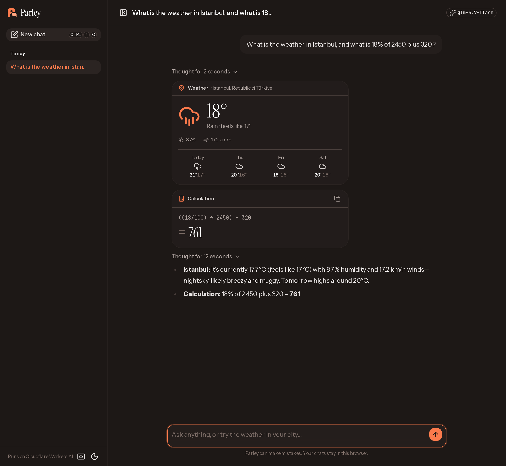

<p align="center">
  
</p>

<h1 align="center">Parley</h1>

<p align="center">
  An AI chat with streaming replies and live tool cards, built with Nuxt 4 and Nuxt UI,<br>
  running entirely on Cloudflare's free tier.
</p>

<p align="center">
  <a href="https://parley.emircan-erdemci.workers.dev"><strong>Live demo</strong></a> ·
  <a href="https://deploy.workers.cloudflare.com/?url=https://github.com/Emircyn/parley">Deploy your own</a>
</p>



<p align="center">
  
  &nbsp;
  
</p>

## Features

- Streaming replies with markdown, syntax-highlighted code blocks and one-click copy
- Stop, regenerate and copy on every reply; the model's reasoning is collapsible
- Tool calls rendered as cards: weather (Open-Meteo), exact calculations, local time
- Chat history kept in the browser, grouped by date, with undo on delete
- Keyboard shortcuts (`?` lists them), mobile layout, light and dark themes
- Locked-down API: Cloudflare Turnstile, a signed session cookie, per-IP and per-session rate limits, strict CSP and XSS-safe Markdown ([details](SECURITY.md))
- A friendly state when the daily free quota runs out

## Stack

- [Nuxt 4](https://nuxt.com) + [Nuxt UI v4](https://ui.nuxt.com) (`UChatMessages`, `UChatPrompt`, `UChatTool`)
- [Vercel AI SDK](https://ai-sdk.dev) with [`workers-ai-provider`](https://www.npmjs.com/package/workers-ai-provider)
- Cloudflare Workers AI (`@cf/zai-org/glm-4.7-flash`), Workers Rate Limiting, Workers static assets
- TypeScript, Tailwind CSS v4, Comark for streaming markdown

## How it fits together

```
app/                     SPA (chats live in localStorage)
  pages/index.vue        start screen with suggestions
  pages/chat/[id].vue    useChat() + UChatMessages + UChatPrompt
  components/tools/      Weather, Calculator and Time cards
server/
  api/chat.post.ts       validate → rate limit → streamText(tools) → UI message stream
  utils/model.ts         the one place that picks the provider and model
  utils/tools.ts         getWeather, calculate, getTime
```

The model is a single setting: `NUXT_PUBLIC_AI_MODEL` (or `runtimeConfig.public.aiModel`).

## Develop

```bash
pnpm install
cp .dev.vars.example .dev.vars   # Turnstile test keys + a session secret for local use
npx wrangler login               # add --device in containers or over SSH
pnpm preview                     # build + wrangler dev, with the real AI binding
```

`pnpm dev` runs the Nuxt dev server; the Workers AI binding is remote, so both use your account's daily neurons.

## Deploy

[](https://deploy.workers.cloudflare.com/?url=https://github.com/Emircyn/parley)

Or from your machine:

1. Create a Turnstile widget (managed mode) for your `*.workers.dev` hostname.
2. In `wrangler.jsonc`, set `TURNSTILE_SITE_KEY` to its sitekey and `TURNSTILE_HOSTNAMES` to your hostname.
3. Deploy and add the two secrets:

```bash
pnpm run deploy
npx wrangler secret put TURNSTILE_SECRET   # the widget's secret key
npx wrangler secret put SESSION_SECRET     # e.g. openssl rand -base64 32
```

On the Workers free plan, requests stop at 10,000 neurons a day, so there's never a surprise bill.

## License

[MIT](LICENSE) © Emircan Erdemci
