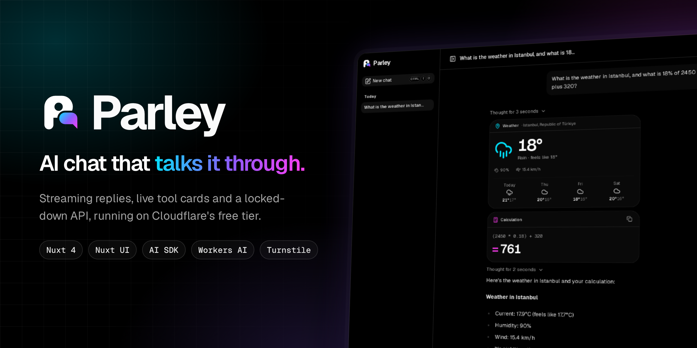
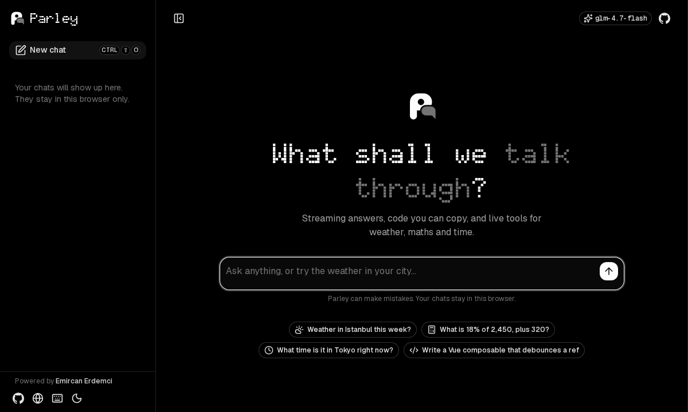
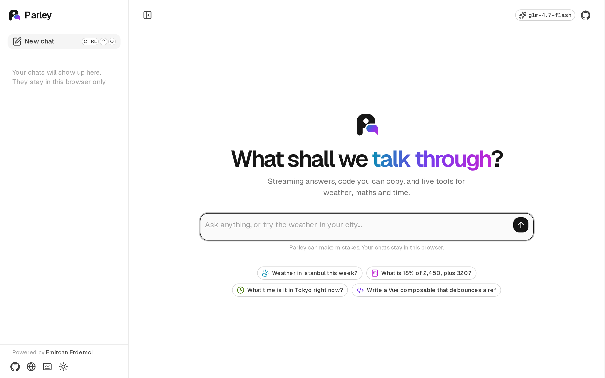
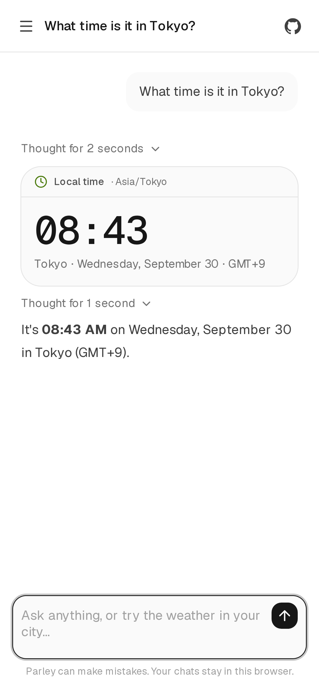
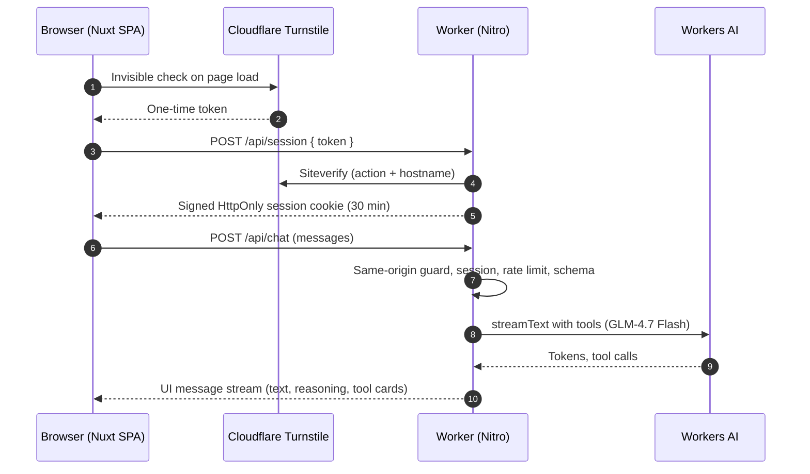

<p align="center">
  
</p>

<p align="center">
  <a href="https://parley.emircan-erdemci.workers.dev"></a>
  <a href="https://github.com/Emircyn/parley/actions/workflows/ci.yml"></a>
  <a href="LICENSE"></a>
  
  
  
  
</p>

<p align="center">
  <b>Parley</b> is an AI chat with streaming replies and live tool cards,<br>
  built with Nuxt 4 and Nuxt UI and running entirely on Cloudflare's free tier.
</p>

<p align="center">
  <a href="https://parley.emircan-erdemci.workers.dev"><b>Try it live</b></a> ·
  <a href="#how-it-works">How it works</a> ·
  <a href="#run-it-yourself">Run it yourself</a> ·
  <a href="https://deploy.workers.cloudflare.com/?url=https://github.com/Emircyn/parley">Deploy your own</a>
</p>

<br>

<p align="center">
  
</p>

## Highlights

| | |
|---|---|
| **Streaming replies** | Tokens render as they arrive, with Markdown, syntax-highlighted code and one-click copy. Stop, regenerate or copy any answer. |
| **Tool calls as cards** | The model calls real tools and the result shows up as a card: a 4-day weather forecast, an exact calculation, the local time anywhere. |
| **Reasoning you can peek at** | The model's thinking streams into a collapsible "Thought for 3 seconds" block. |
| **History in the browser** | Chats are saved locally, grouped by date, and never leave the device. |
| **Built for keyboards and phones** | `⌘⇧O` new chat, `/` focus, `Esc` stop, `?` for the full list. The sidebar turns into a drawer on mobile. |
| **AMOLED dark, clean light** | A monochrome interface on true black with vivid accents per tool, a light mode to match, and a brand loader while the app boots. |
| **A locked-down API** | Cloudflare Turnstile, a signed session cookie, rate limits, a strict CSP and XSS-safe Markdown keep the free AI quota for real visitors. |

<p align="center">
  
  &nbsp;
  
</p>

## How it works



- **Frontend:** a Nuxt 4 SPA. `UChatMessages` and `UChatPrompt` from Nuxt UI, `useChat` from the AI SDK, [Comark](https://github.com/comarkdown/comark) for streaming Markdown.
- **Backend:** one Cloudflare Worker serves the static app and the API. `streamText` runs the model through [`workers-ai-provider`](https://www.npmjs.com/package/workers-ai-provider) with three tools: `getWeather` ([Open-Meteo](https://open-meteo.com)), `calculate` (a small safe parser, no `eval`) and `getTime`.
- **Model:** a single setting (`NUXT_PUBLIC_AI_MODEL`). A reply costs about 23 neurons, so the free 10,000 neurons a day cover roughly 400 messages.

## Security

The demo sits on a free AI quota, so the API only answers people using the site. Scripts, other sites and bots get turned away.

| Layer | |
|---|---|
| Turnstile + signed session | Bot check exchanged for a 30-minute `HttpOnly`, `Secure`, `SameSite=Strict` cookie; `/api/chat` requires it |
| Same-origin guard | Browser requests from this origin only, JSON bodies up to 64 KB |
| Rate limits | 5 messages a minute per IP and per session |
| Input limits | No system messages from clients, 4,000 characters per message, last 16 messages sent to the model |
| Safe rendering | Model output is Markdown only; raw HTML, images and `javascript:` links are stripped |
| Headers | Hash-based CSP (no inline scripts), `frame-ancestors 'none'`, HSTS |

Details and how to report an issue: [SECURITY.md](SECURITY.md).

## Tech stack

| | |
|---|---|
| Framework | [Nuxt 4](https://nuxt.com), Vue 3, TypeScript |
| UI | [Nuxt UI v4](https://ui.nuxt.com), Tailwind CSS v4, Lucide icons |
| AI | [AI SDK](https://ai-sdk.dev) (`useChat`, `streamText`, tools), Cloudflare Workers AI |
| Platform | Cloudflare Workers + static assets, Workers Rate Limiting, Turnstile |
| Quality | ESLint, `vue-tsc`, GitHub Actions CI, Dependabot |

## Project structure

```
app/
  pages/index.vue            start screen with suggestions
  pages/chat/[id].vue        the chat: useChat + UChatMessages + UChatPrompt
  components/tools/          weather, calculation and time cards
  components/chat/           message parts, composer, error states
  composables/               chat history, shortcuts, visitor session (Turnstile)
server/
  api/chat.post.ts           session → rate limit → validate → streamText → stream
  api/session.*.ts           Turnstile token → signed session cookie
  middleware/api-guard.ts    same-origin, method, content type and size checks
  plugins/csp.ts             hash-based Content Security Policy
  utils/                     model, tools, calculator, session, rate limits
```

## Run it yourself

Requirements: Node 22+, pnpm, a Cloudflare account (the free plan is enough).

```bash
git clone https://github.com/Emircyn/parley.git && cd parley
pnpm install
cp .dev.vars.example .dev.vars   # Turnstile test keys and a session secret for local use
npx wrangler login               # add --device in containers or over SSH
pnpm preview                     # build and run the Worker locally with the real AI binding
```

Open http://localhost:8787. Local runs use your account's daily neurons too.

### Deploy

[](https://deploy.workers.cloudflare.com/?url=https://github.com/Emircyn/parley)

Or from your machine:

1. Create a Turnstile widget (managed mode) for your `*.workers.dev` hostname.
2. In `wrangler.jsonc`, set `TURNSTILE_SITE_KEY` and `TURNSTILE_HOSTNAMES`.
3. Deploy and add the two secrets:

```bash
pnpm run deploy
npx wrangler secret put TURNSTILE_SECRET   # the widget's secret key
npx wrangler secret put SESSION_SECRET     # e.g. openssl rand -base64 32
```

On the Workers free plan, Workers AI stops at 10,000 neurons a day instead of billing you.

### Configuration

| Name | Where | Purpose |
|---|---|---|
| `NUXT_PUBLIC_AI_MODEL` | build env | Workers AI model id (default `@cf/zai-org/glm-4.7-flash`) |
| `TURNSTILE_SITE_KEY` | `wrangler.jsonc` vars | Public Turnstile sitekey |
| `TURNSTILE_HOSTNAMES` | `wrangler.jsonc` vars | Hostnames Siteverify must report, comma separated |
| `TURNSTILE_SECRET` | Worker secret | Turnstile secret key |
| `SESSION_SECRET` | Worker secret | 32+ random characters for signing session cookies |
| `TURNSTILE_ALLOW_TEST_KEYS` | `.dev.vars` only | `true` to accept Turnstile's test keys locally |

## License

[MIT](LICENSE) © [Emircan Erdemci](https://emircyn.com)

<br>

<p align="center">
  Powered by <a href="https://emircyn.com"><b>Emircan Erdemci</b></a><br>
  <a href="https://emircyn.com">emircyn.com</a> · <a href="https://github.com/Emircyn">GitHub</a>
</p>
